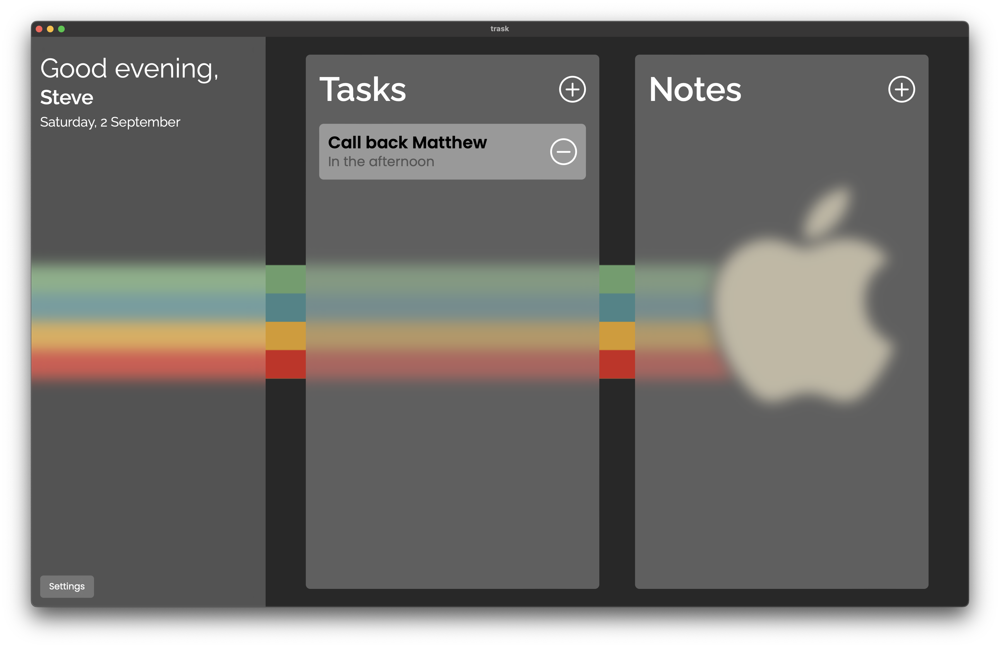
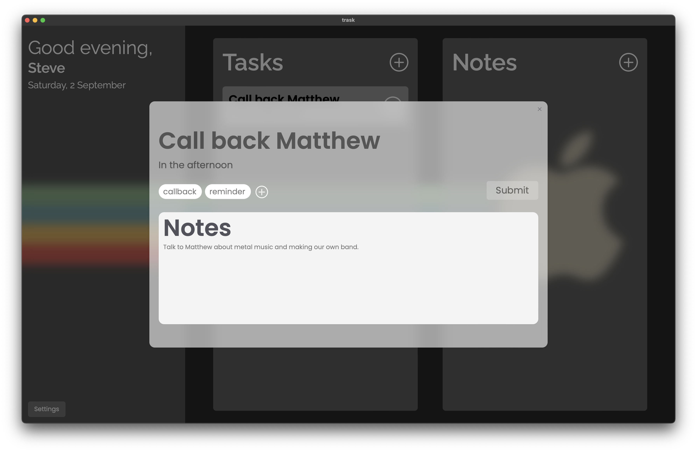

# Trask

This is a nice looking Task and Notes storage manager, built using NextJS, TailwindCSS and Tauri.

## Getting Started

to compile the app, run the following commands in the root of the project:

`pnpm install` - To install all the dependencies

`pnpm tauri dev` - To start the dev version

`pnpm tauri build` - To build a release package/binary
